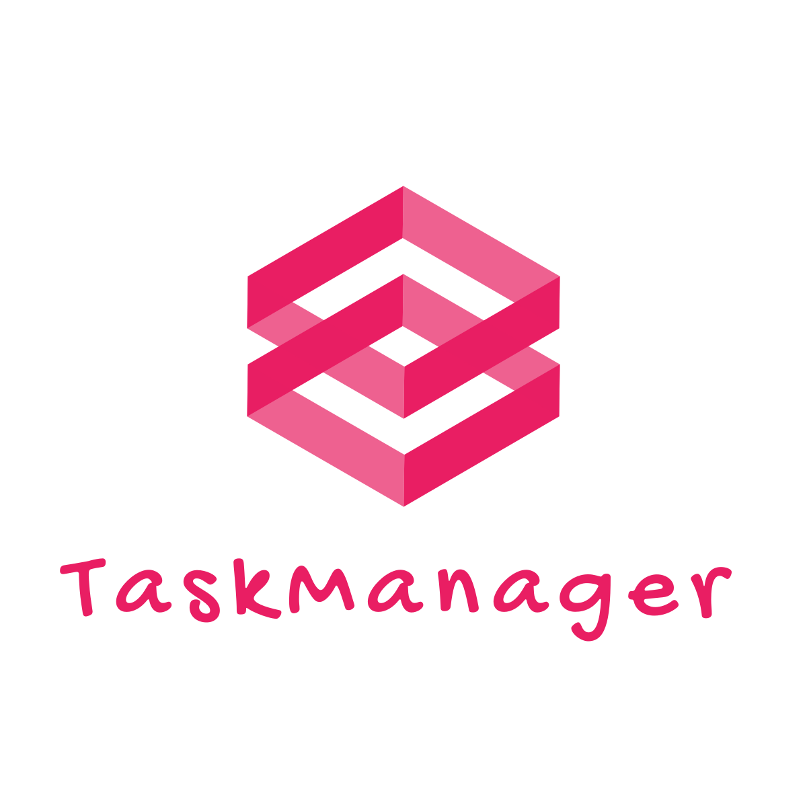

<p align="center">
    
</p>

<h1 align="center">TaskManager Frontend</h1>

<p align="center">A modern project and task management app built with <strong>Next.js</strong>,<strong>Typescript</strong>,<strong>Tailwind CSS</strong>, and <strong>Shadcn/ui</strong></p>

## Features

- Secure authentication (login/register)
- Kanban board for task organization
- Table view of tasks
- Calendar view (coming soon)
- Dynamic dashboard with statistics
- Project management with user assignments
- Clean, responsive user interface

## Installation

```bash
git clone https://github.com/ANDRIANALISOA-sylvere/TaskManager.git
cd TaskManager
npm install
npm run dev
```

## Preview

<p>Screenshots will be added soon...</p>

**Crafted with care by [Joséphin Sylvère](https://josephin-sylvere.vercel.app)**
